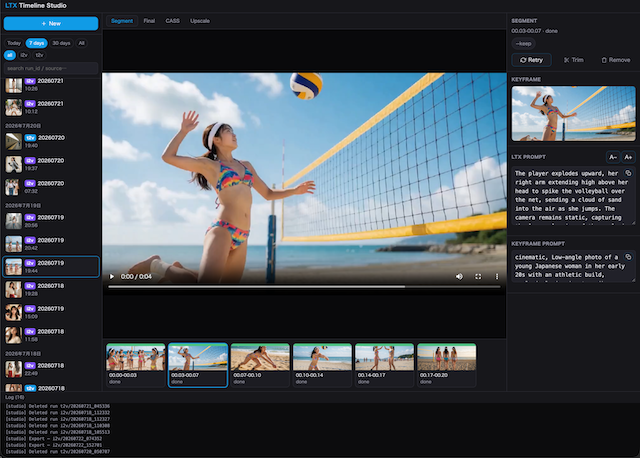

# LTX Timeline

## 更新情報

`git pull`後は`npm run studio:build`でフロントエンドを再ビルドすること(サーバー側JS/Pythonの修正はサーバー再起動のみで反映される)。

### 2026-07-22
- studioのブラウザタイトルから`(prototype)`表記を削除
- Windows/Chromeでログパネルに水平スクロールバーが常時表示される不具合を修正
- CASS/BGM生成/Upscale実行中に進捗ログが表示されない不具合を修正(初回モデルダウンロードの進捗もリアルタイム表示)
- CASS/Upscale/Editプレビューを同一run内で連続実行すると、映像が更新されず自動再生もされない不具合を修正
- Windows環境でRetry時のプロンプト編集がprompts.txtへ反映されない不具合を修正(CRLF改行コード起因)

## 概要

Seedance等で公開されているタイムライン形式のプロンプト(`00:00–00:03 She waves...`のように秒区切りで
動作を並べる書き方)は、そのままローカルのLTX-2.3に渡しても秒指定が読めず、1本のクリップに複数の時間・
場所が同時に詰め込まれて破綻するケースがある。

**このプロジェクトは、タイムラインをセグメント単位に分割し、各区間を
LLMでLTX-2.3が理解できる単発プロンプトに変換して1シーンずつ生成し、ffmpegで連結する**ことでこの問題を解く。

本体は `t2v_timeline_cliV6.py` / `i2v_timeline_cliV6.py`(タイムライン形式の動画生成CLI)。t2v(テキストのみ
直接生成)/i2v(キーフレーム画像経由)の2エンジンに対応。ターミナルからCLI単体で直接使う(後述)ことも、
ブラウザUI(studio)経由で使うこともできる。分割生成ならではの武器として、セグメント単位のリトライ(悪い
シーンだけ録り直す)ができる。仕組みの詳細は[末尾](#タイムライン変換の中身)を参照。

**このNode.jsアプリ(studio)はCLIを使いやすくするためのブラウザUIであり、CLI自体が正常に動く環境が
無ければ機能しない。**セットアップは CLI → CASS → ComfyUI → studio の順に進めること(下記4セクション)。

studio(port **7865**)は3ペイン構成のワークステーション型UI: 左に過去の全run一覧(期間・engine・検索で絞り込み)、
中央にタイムライン(セグメントサムネイル)+プレビュー(Segment/Final/CASS/Upscaleの切り替えタブ)、右に文脈に応じた
Inspector(新規プロンプト作成・生成/Retry設定・セグメント編集・Final側のPrompt閲覧/Edit(トリム・並び替え・連結)/CASS(BGM合成・音源分離)/Upscale(RTX Video Super Resolution))。
Node.js(Express+SSE)バックエンド + Vite/React/TSフロントエンド。



## 必要なもの

1. LM Studio等、OpenAI API互換のLLMエンドポイント(リモートでも可)
2. ComfyUI(リモートでも可。LTX-2.3とKrea2が生成可能なGPU搭載のこと。フルHDへのUpscaleはRTX Video Super Resolutionを使う関係上、NVIDIA GPU必須)
3. GPU(CASSの音源分離で使用。ローカル必須)
4. Python
5. ffmpeg / ffprobe
6. Node.js
7. git(このリポジトリのclone・CASS本家`bandit-v2`のclone用)
8. ACE-Step-1.5(オプション、BGM自動生成を使う場合のみ)

## CLIの設定

1. **Python環境**: このリポジトリ直下に `venv` という名前の仮想環境を作る(**フォルダ名・配置場所は固定**——
   studio(ブラウザUI)がこの場所のPythonを直接呼び出す設計のため)。

   ```bash
   python -m venv venv
   ```

   `uv`を使う場合も同じ構造の仮想環境ができるため、以降の手順は共通:

   ```bash
   uv venv venv
   ```

   有効化してから依存パッケージをインストール:

   ```bash
   # Linux / Mac
   source venv/bin/activate

   # Windows (コマンドプロンプト)
   venv\Scripts\activate.bat

   # Windows (PowerShell)
   venv\Scripts\Activate.ps1

   pip install -r requirements.txt   # openai / httpx / python-dotenv のみ
   ```

   別の場所に仮想環境を置きたい場合は、`.env`の`PYTHON_BIN`にPythonバイナリのフルパス(例:
   `/path/to/venv/bin/python`、Windowsは`C:\path\to\venv\Scripts\python.exe`)を指定すれば上書きできる。
2. **`.env`**: `.env.example` をこのリポジトリ直下に `.env` としてコピーし、値を埋める。まずは
   `LLM_BASE_URL`/`LLM_MODEL`/`LLM_API_KEY`(OpenAI互換API、プロンプト展開Pass0〜4用)だけ設定すれば
   LLMパスの動作確認ができる。例えばLM Studioでモデルを起動している場合:
   ```
   LLM_BASE_URL=http://localhost:1234/v1
   LLM_MODEL=qwen/qwen3.6-35b-a3b
   LLM_API_KEY=dummy
   ```
   （vLLM/SGLang/クラウドAPI等OpenAI互換であれば`LLM_BASE_URL`を差し替えるだけでよい）。ComfyUI/CASS
   関連キーはそれぞれの設定セクションで追って埋める
3. **ffmpeg/ffprobe**: セグメント連結・フェード処理に必須。PATHが通っていること
4. 動作確認(ComfyUI無しでLLMパスだけ確認できる、`venv`を有効化した状態で実行):
   ```bash
   python t2v_timeline_cliV6.py --h --f prompt/example.txt --debug
   ```

LLMパスが確認できたら、[ComfyUIの設定](#comfyuiの設定)を済ませれば実際の動画生成(`--debug`無し)まで確認できる。
[CASSの設定](#cassの設定)は⑤CASSタブ(BGM生成・音源分離)を使う場合のみ必要で、動画生成そのものには不要。
CLIの詳しい使い方(オプション・プロンプト形式・`--retry`/`--direct`/`--upscale`)は[末尾](#v6タイムラインcliの使い方)を参照。

## CASSの設定

⑤ CASSタブは「音源選択(File)もしくはBGM生成」と「音源分離・BGM合成」の2機能から成る。前者はBGM生成(ACE-Step-1.5)を使わない限り追加の環境構築は不要、後者は別の外部ツール・別のPython環境を必要とする。

### BGM生成(ACE-Step-1.5、オプション)

BGM生成機能は [ACE-Step-1.5](https://github.com/ace-step/ACE-Step-1.5) のAPIサーバーを使用する。このリポジトリには含まれないため、別途環境構築・動作確認が必要。

**これは必須ではない。** 後述の「音源分離・BGM合成」(speech/music/sfxの分離・差し替え)自体はACE-Step無しでも問題なく使える。`.env`に`ACESTEP_URL`/`ACESTEP_MODEL`を設定しない場合、studioのCASSパネルでは「Generate」(自動生成)の選択肢が自動的に非表示になり、代わりに「File」モード(手持ちのBGM音声ファイル: mp3/wav/m4aをアップロードまたは選択)でBGMを差し替えられる。

- ACE-Step-1.5側でAPIサーバーを起動しておくこと(Windowsは`start_api_server.bat`、Linux/Macは`start_api_server.sh`)
- `.env` の `ACESTEP_URL`(APIサーバーのURL)・`ACESTEP_MODEL` をそのサーバーに合わせて設定
- studio経由では`bridge.py`がライブラリとして呼び出すため意識不要だが、**studioを使わずCLI単体でBGMを生成する場合は`bgm_generate_cli.py`を直接実行する**:
  ```bash
  python -m bgm_generate_cli --help
  ```

### 音源分離・BGM合成

`CASS/` 配下の別ツール([BandIt v2](https://github.com/kwatcharasupat/bandit-v2)ベース)を使用する。動画/音声を **speech(セリフ) / music(音楽) / sfx(効果音)** の3ステムに分離し、BGMだけ別音源(上記で生成、または手持ちのファイル)に差し替えた動画を作れる(セリフ・効果音は維持)。

**依存パッケージはリポジトリ直下の`venv`に追加インストールするだけでよい**(専用の仮想環境は不要。`requirements.txt`と`CASS/requirements.txt`の間にパッケージの重複・バージョン衝突が無いことを確認済み)。加えて、モデル定義コードの参照元として本家`bandit-v2`のcloneも必要:

```bash
# リポジトリ直下でvenvを有効化した状態で
pip install -r CASS/requirements.txt

# 本家リポジトリのclone(モデルコードのみ利用、requirements.txtは使わない)
cd CASS
git clone --depth 1 https://github.com/kwatcharasupat/bandit-v2.git repo
cd ..
```

- 学習済み重みはZenodo(CC BY-SA 4.0)から`separate.py`実行時に自動ダウンロードされる(手動DL不要)
- `process.py`実行には`ffmpeg`/`ffprobe`が必須
- studioのCASSパネルから使う場合、`studio/server/cass.js`が内部でリポジトリ直下の`venv`のPythonを使って`CASS/separate.py`・`CASS/process.py`を呼び出す
- セットアップ手順の詳細・オプション・ライセンスは [CASS/README.md](CASS/README.md) 参照

**PyTorchのGPU(CUDA)インストールについて(Windows)**: `CASS/requirements.txt`が入れる`torch`はCPU実行も可能だが、実測でCPUは実用に耐えないほど遅い(BandIt v2の音源分離)。GPUで使う場合、[PyTorch公式サイト](https://pytorch.org/get-started/locally/)でお使いのCUDAバージョンに合ったコマンドを確認し、個別に上書きインストールすること(CUDAバージョンはマシンごとに異なるため、`requirements.txt`側で決め打ちにはできない)。

```bash
pip install -U torch torchaudio
```

インストール後は、CASSを実際に使う前に単体でimportできるか事前確認すると事故が少ない:

```bash
venv\Scripts\python.exe -c "import torch; print(torch.__version__)"
```

環境によっては`OSError: [WinError 1114] ... Error loading "...\torch\lib\c10.dll"`のようなDLL初期化エラーが出ることがある。Microsoft Visual C++再頒布可能パッケージ([vc_redist.x64.exe](https://aka.ms/vs/17/release/vc_redist.x64.exe))の不足が原因のことが多いが、それでも解消しない場合はPyTorchのバージョン自体(特定バージョンでのWindows固有バグ)を疑い、前後のバージョンへ変更して試すこと:

```bash
pip install -U torch==<別バージョン>
```

## ComfyUIの設定

[ComfyUI](https://github.com/comfyanonymous/ComfyUI)本体を別途セットアップし、サーバーを起動しておくこと。
`workflows/`のワークフローJSONが要求するカスタムノード(LoRA Stack等)が未インストールの場合、
ComfyUI Manager の「Install Missing Custom Nodes」でワークフローを開けば自動検出・導入できる。
起動後、`.env`の`COMFYUI_IMAGE_URL`(キーフレーム生成用)・`COMFYUI_VIDEO_URL`(動画生成・アップスケール用)をそのサーバーに合わせること。

**ワークフロー単体の動作確認**: `workflows/`配下のJSONファイルをComfyUIの画面にドラッグ&ドロップすれば、そのワークフローが読み込まれる。そのまま「Run」して最後まで通ればモデル・カスタムノードの設置は問題ない。

モデル名やパスを変更した場合は、ComfyUIの「Export (API) / Dev Mode」で書き出す(このリポジトリのCLIが読み込むのはAPI形式のJSONのため、通常の「Save」ではなく必ず「Export (API)」を使う)。**このとき`video.json`/`image.json`のように既存と同じファイル名で上書きしないこと**——これらはgitで追跡されているベースファイルのため、同名上書きすると後で`git pull`した際にローカルの変更(自分用のモデル設定)と衝突する。代わりに別名(例: `my_video.json`)で保存し、`.env`の対応する変数でそのファイル名を指定する:

| `.env`変数 | 差し替えたいワークフロー |
|---|---|
| `KEYFRAME_WORKFLOW_JSON` | `image.json`(i2vキーフレーム生成) |
| `I2V_VIDEO_ENGINE` | i2vの動画生成(通常は`video.json`) |
| `T2V_VIDEO_ENGINE` | t2vの動画生成(通常は`video.json`) |

`rtx_video_upscale.json`(アップスケール)は差し替え用の`.env`変数は無いが、NVIDIAドライバ内蔵機能を使うだけでモデル・パス指定が無いため、通常はカスタマイズの必要自体が無い。

### 必要なモデル(重み)

`workflows/`のベース3ワークフロー(`video.json`/`image.json`/`rtx_video_upscale.json`)が読み込む重み。ComfyUI側の該当フォルダ(checkpoints/loras/unet/clip/vae等)に事前に配置しておくこと。

**`video.json`(t2v/i2v動画生成)**
- Checkpoint: [`ltx-2.3-22b-dev-fp8.safetensors`](https://huggingface.co/Lightricks/LTX-2.3-fp8/blob/main/ltx-2.3-22b-dev-fp8.safetensors)
- LoRA: [`ltx_2.3_22b_distilled_1.1_lora_dynamic_fro09_avg_rank_111_bf16.safetensors`](https://huggingface.co/Comfy-Org/ltx-2.3/blob/main/split_files/loras/ltx_2.3_22b_distilled_1.1_lora_dynamic_fro09_avg_rank_111_bf16.safetensors)
- LoRA: [`LTX-2.3-OmniNFT-RL-Lora_bf16.safetensors`](https://huggingface.co/Kijai/LTX2.3_comfy/blob/main/loras/LTX-2.3-OmniNFT-RL-Lora_bf16.safetensors)
- Latent Upscale Model: [`ltx-2.3-spatial-upscaler-x2-1.1.safetensors`](https://huggingface.co/Lightricks/LTX-2.3/blob/main/ltx-2.3-spatial-upscaler-x2-1.1.safetensors)

**`image.json`(i2vキーフレーム生成)**
- UNET: [`krea2_turbo_int8_convrot.safetensors`](https://huggingface.co/Comfy-Org/Krea-2/blob/main/diffusion_models/krea2_turbo_int8_convrot.safetensors)
- CLIP: [`qwen3vl_4b_fp8_scaled.safetensors`](https://huggingface.co/Comfy-Org/Krea-2/blob/main/text_encoders/qwen3vl_4b_fp8_scaled.safetensors)
- VAE: [`qwen_image_vae.safetensors`](https://huggingface.co/Comfy-Org/Krea-2/blob/main/vae/qwen_image_vae.safetensors)

**`rtx_video_upscale.json`(アップスケール)**
- 追加の重みファイル不要。NVIDIAドライバ内蔵のRTX Video Super Resolution機能を使用(対応GPU必須)

### カスタムノード

いずれもComfyUI Managerの「Install Missing Custom Nodes」で導入可。

- `video.json`・`image.json`共通: [rgthree-comfy](https://github.com/rgthree/rgthree-comfy)
- `rtx_video_upscale.json`: [Nvidia_RTX_Nodes_ComfyUI](https://github.com/Comfy-Org/Nvidia_RTX_Nodes_ComfyUI)

### .env 設定(ワークフロー関連)

| 変数 | 意味 |
|---|---|
| `COMFYUI_IMAGE_URL` / `COMFYUI_VIDEO_URL` | ComfyUIサーバーのURL(画像=キーフレーム生成 / 動画=I2V・T2V・アップスケール) |
| `KEYFRAME_LORA_NAME` / `KEYFRAME_LORA_STRENGTH` | `image.json` node76の`lora_01`/`strength_01`を上書き。名前が空=そのまま、強度`-1`=そのまま、`0`=キャラLoRA無効(任意キャラ用) |
| `KEYFRAME_WORKFLOW_JSON` | キーフレーム生成に使うComfyUIワークフローJSON(`workflows/`配下)。デフォルト`image.json` |
| `KEYFRAME_SIZE_SCALE` | キーフレーム生成解像度の倍率(動画のwidth/heightに対して、アスペクト比維持)。デフォルト`1.0`。Krea2は`1.2`推奨 |
| `FADE_OUT_ENABLED` | 最終連結動画の末尾フェードアウト(映像・音声とも1秒)。デフォルト`true` |
| `I2V_VIDEO_ENGINE` | i2vの動画生成に使うComfyUIワークフローJSON(`workflows/`配下)。デフォルト`default`(`video.json`と同じI2Vモード)。`.json`ファイル名を指定するとそのファイルをそのまま使う(`video.json`と同じノードID体系を持つことが必須、指定JSONが無い/ノード構成が異なる場合のエラーは自己責任) |
| `T2V_VIDEO_ENGINE` | t2vの動画生成に使うComfyUIワークフローJSON(`workflows/`配下)。デフォルト`video.json`。指定JSONが無い/ノード構成が異なる場合のエラーは自己責任(バリデーション無し) |
| `IMAGE_PROMPT_PREFIX` | 画像プロンプト冒頭に付加する品質向上prefix |

## ブラウザUI(studio)

CLI・CASS・ComfyUIの動作確認ができたら、ブラウザから操作したい場合のみ以下を実行:

```bash
npm install              # 初回のみ(studio/client側も自動でinstallされる)
npm run studio:build     # フロントエンドのビルド(studio/client/src変更時に再実行)
npm run studio:start     # → http://localhost:7865
```

開発時(サーバー自動再起動、`--watch`):

```bash
npm run studio:dev
```

フロントエンド単体のHMR(port 5175、`/api`・`/media`をstudioサーバーへプロキシ):

```bash
npm --prefix studio/client run dev
```

### 構成

| パス | 実体 | 説明 |
|---|---|---|
| `t2v_timeline_cliV6.py` / `i2v_timeline_cliV6.py` / `bgm_generate_cli.py` | 実ファイル | CLIエントリポイント(`python -m`で直接起動) |
| `modules/` (`timeline_common.py` / `comfyui_client.py` / `pipeline_config.py` / `prompt_generator.py`) | 実ディレクトリ | 上記CLIから呼ばれる共有ロジック(単体では実行しない) |
| `workflows/` `CASS/` | 実ディレクトリ | ComfyUIワークフロー・音声分離ツール一式 |
| `prompt/` `generated/` `uploads/` `CASS/{output,bgm,input,tmp}/` | 実ディレクトリ | 作業・入出力はすべてこのフォルダ直下 |
| `.env` | 実ファイル | studio・CLI共通で必要なキーを保持。編集は即時反映(再起動不要) |
| `bridge.py` | 実ファイル | パース・連結・アップスケール・BGM生成をPython実装のまま呼ぶJSONシム |
| `studio/server/` | 実ディレクトリ | studioのExpress(ESM)バックエンド(port 7865) |
| `studio/client/` | 実ディレクトリ | studioのVite + React + TS SPA(3ペイン構成) |

### .env 設定(LLM関連)

| 変数 | 意味 |
|---|---|
| `LLM_BASE_URL` / `LLM_MODEL` / `LLM_API_KEY` | プロンプト展開(Pass0〜4)・要約・BGM説明文生成に使うOpenAI互換LLM |

**thinking(reasoning)モデルを使う場合の注意**: DeepSeek系など「思考過程」を出力するモデルを`LLM_MODEL`に指定すると、system promptが長いパス(特にPass1のショットディレクター)でreasoning側のトークン消費が実応答より大きくなり、生成が大幅に遅くなったり、`max_tokens`予算を思考だけで使い切って本文が空になったりすることがある。可能な限り、サーバー側(vLLM・LM Studio・SGLang等)の設定でthinkingをOFFにした状態で使うことを推奨する。このプロジェクトのコード側でも主要なOpenAI互換パラメータ(`thinking: {"type": "disabled"}`)を全LLM呼び出しに付与しているが、対応していないサーバー実装では効かない場合がある。

## V6タイムラインCLIの使い方

- **t2v**(`t2v_timeline_cliV6.py`): キーフレームを経由せず、LTX-2.3のT2Vモードにテキストプロンプトだけで直接動画生成。出力prefixは`t2v6_`
- **i2v**(`i2v_timeline_cliV6.py`): 各セグメントの1stフレームをZ-Image/Krea2(`image.json`、`.env`の`KEYFRAME_WORKFLOW_JSON`で差し替え可)で先に生成し、LTX-2.3のI2Vで動かす方式。出力prefixは`i2v6_`(キーフレームは`..._seg{NN}_kf.png`として残る)

```bash
python t2v_timeline_cliV6.py --h --f prompt/example.txt          # 横 1280×720
python t2v_timeline_cliV6.py --v --f prompt/example.txt          # 縦 720×1280
python t2v_timeline_cliV6.py --h --f prompt/example.txt --debug  # プロンプト確認のみ

python i2v_timeline_cliV6.py --h --f prompt/example.txt          # 横 1280×720
python i2v_timeline_cliV6.py --h --f prompt/example.txt --debug  # プロンプト確認のみ
```

### オプション

| オプション | 値 | 備考 |
|---|---|---|
| `--h` | フラグ | 横向き 1280×720(16:9)。LLMへの構図指示も横構図に |
| `--v` | フラグ | 縦向き 720×1280(9:16)。LLMへの構図指示も縦構図に |
| `--f` | `FILE.txt` | プロンプトファイルのパス(`prompt/`配下推奨)。通常実行時必須 |
| `--debug` | フラグ | LLMパスのプロンプト生成のみ実行。ComfyUI/ffmpegをスキップ。反復改善に使う |
| `--retry` | `RUN_ID` | 既存runの指定セグメントだけ別seedで再生成→final再連結(下記参照)。`--f`とは排他 |
| `--seg` | `N[,N...]` | `--retry`で再生成するセグメント番号(1始まり、カンマ区切り)。`--retry`省略時は直近runを自動使用 |
| `--keep` | フラグ | (i2vのみ)`--seg`専用。既存のキーフレーム画像をそのまま使い、動画生成だけをやり直す |
| `--direct` | `SECONDS` | デバッグ用。LLMパイプラインを一切通さず`--f`のファイル内容をそのままComfyUIに渡してSECONDS秒の動画を1本生成(下記参照) |
| `--upscale` | `[RUN_ID]` | 既存runの最終動画(`_final.mp4`)をRTX Video Super ResolutionでフルHD化(下記参照)。他の引数とは排他 |

### プロンプトファイル構造

```
[グローバル説明 — キャラクター/ロケーション/スタイル/カメラ等]

[タイムライン区間 × N]

Ambience: [アンビエンス/環境音の説明]
```

- `Timeline:` ヘッダーは省略可。最初のタイムスタンプ行より前のテキスト全体がグローバル説明になる
- `Audio:` でも `Ambience:` でも可。内容が同一行でも次行でも対応
- **タイムライン区間が無い1本の物語文でも可**(Pass -1が自動でビート分割)。各ビートは3秒以上、合計尺に上限は設けない

### タイムスタンプ形式(6種対応・混在可)

| 形式 | 例 |
|---|---|
| A — 秒・1行(小数可) | `0–2s: She walks down the alley` / `0–1.5s: She waves` |
| B — MM:SS・1行(矢印/コロンは省略可) | `00:00–00:03 She waves at the camera` / `00:00–00:03 → She waves at the camera` |
| C — MM:SS単独行 + 次行に説明 | `00:00–00:02`(改行)`She sits on a step tying laces.` |
| D — ブラケット・1行 | `[0:03–0:06] She crouches to feed a cat` |
| E — **bold**タイムスタンプ + 次行 | `**00:00–00:02**`(改行)`She sits on a step tying laces.` |
| F — 秒・ブラケット単独行 + 次行以降に説明(小数可) | `[0s – 1.5s]`(改行)`She waves at the camera.` |

### 出力

| ファイル | 内容 |
|---|---|
| `generated/{prefix}_YYYYMMDD_HHMMSS_seg{N}_{label}.mp4` | セグメント動画(`prefix`は`t2v6`/`i2v6`) |
| `generated/{prefix}_YYYYMMDD_HHMMSS_final.mp4` | ffmpeg連結済み最終動画。`.env`の`FADE_OUT_ENABLED`(デフォルトON)で末尾1秒フェードアウト付き |
| `generated/{prefix}_YYYYMMDD_HHMMSS_prompts.txt` | セグメント別LLM生成プロンプト記録 |
| `generated/i2v6_YYYYMMDD_HHMMSS_seg{NN}_kf.png` | (i2vのみ)キーフレーム画像 |

### セグメント単位リトライ(`--retry`)

`prompts.txt` に保存済みのプロンプトを逐語再利用して対象セグメントだけ別seedで再生成し、finalを再連結する(LLMパスは走らない)。i2vはキーフレーム画像から作り直す。

```bash
python t2v_timeline_cliV6.py --retry 20260704_080510 --seg 3,7
python t2v_timeline_cliV6.py --seg 3,7   # --retry省略で直近のrun
python i2v_timeline_cliV6.py --seg 3 --keep # キーフレームは既存のまま動画だけやり直す
```

旧takeは `..._old1.mp4` 等に退避され、比較試聴できる(concat対象外、Libraryタブでも「old」ラベル付きで確認可能)。

### 生テキストを直接ComfyUIに渡す(`--direct`、デバッグ用)

Pass0〜Pass4のLLMパイプラインを一切通さず、`--f`のファイル内容をそのまま1本のプロンプトとしてComfyUIへ渡し、指定秒数の動画を1本だけ生成する。「LLM加工が結果にどう影響しているか切り分けたい」「特定の文言がそのままどう出るか素で確認したい」というデバッグ用途。

**通常実行時のタイムライン無しプロンプトとは別物なので注意**: `--direct`を付けない通常実行では、タイムライン区間の無いプロンプトファイルでもPass -1が自動的にタイムライン形式(セグメント分割済み)へ内部変換してから通常のPass0〜4パイプラインに渡す(上記「プロンプトファイル構造」参照)。一方`--direct`は、この自動変換も含めLLM処理を一切行わず、ファイル内容をそのまま1本のプロンプトとして使う。

```bash
python t2v_timeline_cliV6.py --direct 5 --h --f prompt/raw.txt
python i2v_timeline_cliV6.py --direct 4 --v --f prompt/raw.txt
```

- `--f`のファイルは**タイムライン形式である必要はない**(`_parse_prompt`を経由しないため)。ファイル全文がそのままプロンプトになる
- i2vのみ: ファイルに`--- Keyframe prompt ---`区切りがあればKeyframe用/Motion用に分割して使う。無ければ全文をKeyframe・Motion両方に使う
- `--retry` / `--seg` / `--upscale` / `--debug` とは同時指定できない(`parser.error`)。`--keep`は新規生成のため無効(指定時は警告のうえ無視)
- 出力は通常runと同じ命名規則(`{prefix}_{run_id}_seg01_direct.mp4` / `_final.mp4` / `_prompts.txt`、`prompts.txt`に`direct: true`ヘッダー)で書かれるため、Generate/Retry/Edit/Libraryタブは無改修でdirectモードのrunを表示・操作できる
- **リトライも可能**: directモードのrunは常にセグメント1つのみのため、`--retry RUN_ID`だけで`--seg`を省略できる(自動的に`seg 1`扱い)。i2vなら`--keep`でキーフレームを再利用したまま動画だけやり直せる

```bash
python t2v_timeline_cliV6.py --retry 20260715_120000        # --seg省略可(directモードのrunのみ)
python i2v_timeline_cliV6.py --retry 20260715_120500 --keep # キーフレームは既存のまま動画だけやり直す
```

### 動画アップスケール(`--upscale`)

既存runの最終動画をRTX Video Super Resolution(`workflows/rtx_video_upscale.json`)でフルHD相当にアップスケール。

```bash
python t2v_timeline_cliV6.py --upscale                    # 直近runの_final.mp4
python t2v_timeline_cliV6.py --upscale 20260708_204212     # run_id指定
python i2v_timeline_cliV6.py --upscale
```

出力は`{run_id}_final_FHD.mp4`(元ファイルは残る)。

### LLMアーキテクチャの概要

Pass0(Creative Director)→Pass1(Shot Director)→Pass1.5(Variety Auditor)→Pass2(Scene Writer)→Pass3(t2v: LTX Formatter / i2v: Keyframe+Motion Formatter)という構成。各Passの後にPython決定論チェックが入り、違反があれば専用fixerが最小修正する。中身の詳細は[タイムライン変換の中身](#タイムライン変換の中身)、開発経緯・各バグ調査の詳細は `CLAUDE.md` 参照。

## タイムライン変換の中身

1本のタイムラインプロンプトから最終的な生成用プロンプトを組み立てるまでを、映画の撮影現場のスタッフ分担に例えると分かりやすい。「AIひとりに全部いい感じにやらせる」のではなく、地味な仕事と派手な仕事を別々の担当(=別々のLLM呼び出し)に分けているのが設計の核。t2v/i2v共通で、こんな順番で仕事が流れる(`timeline_common.py`)。

**前半(撮影準備チーム)**: ①キャラクター係(不変の身元情報だけ抽出) → ②監督(各場面の役割・テンポを決める) → ③記録係(場所・服装・持ち物の変化を追跡) → ④撮影監督(構図・カメラワーク) → ⑤単調さチェック係(正面顔の連続などを検出して書き直し指示) → ⑥情景描写係(画面の中身を言葉にする)

**後半(翻訳・検品チーム)**: ⑦翻訳者(t2v向け/i2v向けに言葉遣いを丸ごと変換) → ⑧検品係(分身・持ち物の二重生成等をチェックリストで機械的に検出し、違反があれば直させて再検査)

コード上は Pass0(Creative Director)→Pass1(Shot Director)→Pass1.5(Variety Auditor)→Pass2(Scene Writer)→Pass3(Formatter) という名前になっている。

いくつか、作りながら見えてきた設計判断:

- **①と③は最初、同じ1回のLLM呼び出しにまとめていた。** 動かすと②の演出判断(監督の仕事)は毎回きちんと機能するのに、③の地味な記録作業だけがサボられて「前と同じです」と省略される事故が繰り返し起きた。派手な仕事と地味な仕事を同じ人に同時にやらせると、地味な方が手抜きされる——対策は担当を分けて独立に呼び出すことだけだった(並列実行なので待ち時間はほぼ増えない)
- **③には「変化なし」という決まり文句しか許さない二択ルールがある。** 「前回と同じです」を自分の言葉で書かせると微妙な省略が紛れ込むので、全部書き直すか、リテラルな`NO CHANGE`と書くかの二択に絞った。そう来たらPython側が前の記録をそのままコピーする——AIに正確な転記をさせる必要すらない
- **髪型やメガネは①(不変)と③(その都度)のどちらの管轄か、最初は曖昧だった。** ③側に置いていた頃は、変化が無い場面で細かい情報だけがすっぽり抜け落ちる事故が起きた。「これは本当に場面ごとに変わるものか、それともこの人自身の一部か」と問い直して①へ移したところで解消した
- **⑦は、i2v用の指示文をゼロから新規に書かせるのをやめている。** 短い予算(40〜80語)の中に全部詰め込ませようとすると情報が競合して脱落しやすい。t2v向けに既に作った確実性の高い文章を土台にして、そこから必要な部分だけ抜き出す方式にしたら安定した

それぞれのロジックの実装は `modules/timeline_common.py`(前半・t2v/i2v共通部分)と `t2v_timeline_cliV6.py` / `i2v_timeline_cliV6.py`(後半・エンジン別の変換部分)にある。
